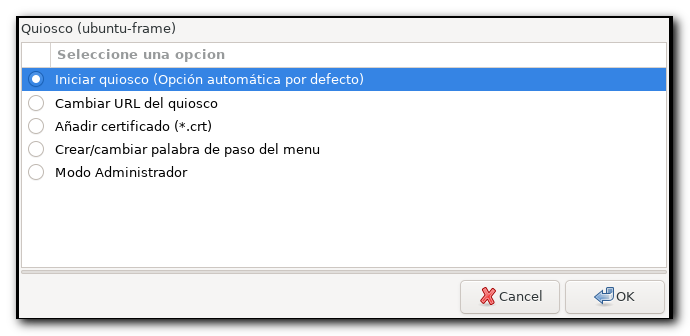

# install_frame_webkit_kiosk.sh 

Script para desplegar la interfaz gráfica de un quiosco interactivo  utilizando el paquete snap [**wpe-webkit-mir-kiosk**](https://gitlab.com/glancr/wpe-webkit-snap) mediante [**Ubuntu-Frame**](https://mir-server.io/ubuntu-frame) en un servidor [**Ubuntu Server LTS**](https://ubuntu.com/download/server).

- [**Ubuntu-Frame**](https://mir-server.io/ubuntu-frame) es una shell para implementar aplicaciones gráficas para kioskos interactivos, soluciones de señalización digital, etc. La shell proporciona comunicaciones seguras cliente-servidor utilizando el protocolo ```Wayland``` y las aplicaciones solo pueden comunicarse a través de un socket seguro lo cual reduce los vectores de ataque para el código malicioso (Ubuntu-Frame está soportado durante 10 años)

- [**wpe-webkit-mir-kiosk**](https://gitlab.com/glancr/wpe-webkit-snap) es un fork de [**WPE WebKit**](https://wpewebkit.org/) en un paquete snap para usar en quioscos a pantalla completa.


  
  
  
  
  
  
  
  
  

  
  
Para facilitar el despiegle de quioscos con wpe-webkit-mir-kiosk se proporciona un quiosco configurado en dos formatos

- ISO
- IMG

## ISO

Imagen autoarrancable para desplegar un quiosco (formato: ISO)

- [**frame-webkit-kiosk v00r15.iso**](https://drive.google.com/file/d/1CTjsEu1P-FKhqsFZhKAX96KomY4V4O2X/view?usp=sharing) (30/05/2022) Imagen ISO del quiosco versión v00r15x (Ubuntu Server 22.04 LTS - Jammy Jellyfish) 

## Imagen persistente 

Imagen autoarrancable para desplegar un quiosco en modo persistente (formato: IMG)

- [**frame-webkit-kiosk v00r15.img**](https://drive.google.com/file/d/1dC2_25N0Mtdn8ElkGLaiev-IjHmpo5KX/view?usp=sharing) (30/05/2022) Imagen persistente del quiosco versión v00r15x (Ubuntu Server 22.04 LTS - Jammy Jellyfish)

Para desplegar la imagen en un pendrive puede utilizar Rufus (https://rufus.ie/). 
Si el sistema no arranca en equipos con el ```firmware UEFI``` puede ser debido a que en la BIOS está activada la opción **Secure Boot**.
